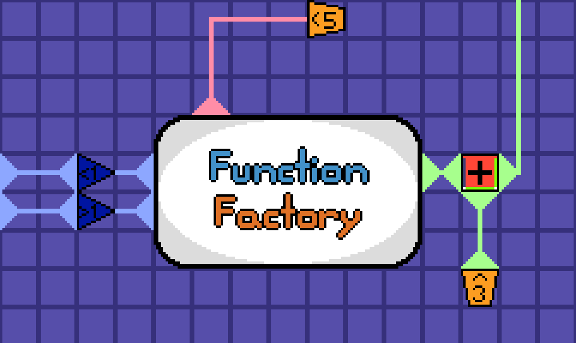

**This project has been discontinued**

# Function Factory
Function Factory is a math-based puzzle game where the player links up various objects to complete circuits. It's a hard game to explain with words, so look at the gif above.  
  
On the pink line, we simply have a dispenser spitting out a "5" block that's sent into the center. On the green line we have a dispenser with a 3 and another line that gives a 6 from off screen. These numbers are combined by an addition operator, which gives a 9 block that goes into the center. On the two blue lines, we have two 2 blocks. One gets evaluated by a > 1 block, and gets through, and the other gets evaluated by a < 1 block and gets stuck.

If you wanna learn more about the game, feel free to dive into the game's source code (pretty buggy rn) or read the files in the docs folder.

# Roadmap
 - alpha v0.1 tech demo
     - Empty room in design mode
     - Just a showcase of what the different entities do
 - alpha v0.2
     - Switch engines to Godot since having nodes and signals will be much easier for this game

# Planned Features
 - Free to play version with access to:
    - Around 50% of the game's content
    - No ads
    - Access to workshop levels (cannot be played if they use entities from the paid level packs)
 - Buyable version for ~$10 with access to:
    - Everything in the free version
    - More level packs
    - Level editor
    - Access to levels that use entities from the extra level packs

# Planned Platforms
 - Free demo on HTML
 - Steam version (Steam deck optimized)
 - Android version
 - If I have enough time/money:
    - IOS version
    - Switch/PSX/Xbox
